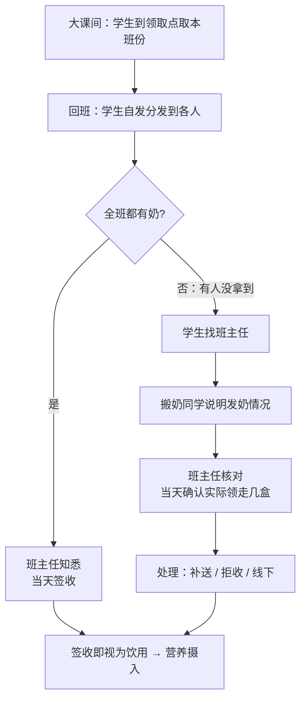

# 业务边界与责任域

> 本文定义本系统覆盖的业务链段、三个边界决策点及其裁决口径，作为后续需求评审、
> 待办项判定与文档写作的统一依据；涉及边界的新需求，先对照本文 §四 速查表裁决，
> 越界项须先在本文登记后再讨论实现。
>
> 相关文档：`系统架构.md`（模块与状态机）、`业务过程与可靠执行模型.md`（核心抽象）、
> `可靠性设计.md`（机制细节与判定口径）、`../研发规范/项目开发规范.md`（业务规则）、
> `../论文/后续扩展方案.md`（拓展项登记）。

## 一、定位

**本系统 = 学校配送站的「订购 + 按班分发履约 + 班主任签收确认」系统。**

- 使用方：学校内部。家长订购，学校配送站履约分发，班主任签收确认。
- 业务链：奶企 → 学校配送站（收货、按班分类）→ 公共领取点 → 班级/学生 → 班主任签收确认。
- 与核心抽象的关系：`业务过程与可靠执行模型.md` 声明"校园乳品配送只是**验证场景**，研究对象是
  **周期性业务履约的状态管理与异常恢复**"；本文定义该验证场景**具体的业务边界**——即系统对
  真实业务链建模到什么程度、刻意不建什么及理由。

## 二、业务链全景

> 注：图为简化示意。物理上奶放在学校公共领取点，但**配送站已按班级分类**（一箱/一筐一班），
> 学生只承担"走路取走本班份"的搬运动作——即"逻辑送班"，见 §三 P2。

### 责任域划分

| 业务段 | 谁执行 | 谁确认 | 系统是否建模 | 建模形态 / 说明 |
| --- | --- | --- | --- | --- |
| 采购订货（配送站向奶企下单） | 学校配送站（线下/奶企系统） | — | **不建模** | 商务层，属奶企与学校合同域；需求侧已由家长订购 + 配额计划覆盖 |
| 到校收货 / 到货 | 学校配送站 | 配送站 | **现状不建模；轻登记为规划项（未实施）** | 配额池=**供货计划**而非牛奶实体；轻登记（数量 + 可选批次）用于"应送 vs 实到"差异预警与批次追溯钩子的数据来源，见 §三 P1 |
| 按班分类 / 校内分发 | 学校配送站 | 配送站（"今日已送出"） | **已建模** | `delivery_task` 按"品种 × 日期 × 班级"展开；`batch-start` 记录派送人/派送时间 |
| 学生领取（走路取本班份） | 学生 | 不确认 | **不建模** | 领取动作是物理搬运；以"签收即视为饮用"收口 |
| 班级签收 / 拒收 | 班主任 | 班主任（当天） | **已建模** | 签收/拒收；营养摄入由签收生成，禁止手工篡改 |
| 退款 / 毕业清算 | 管理员 | 管理员 | **已建模** | 退款域，见 `../研发规范/项目开发规范.md` §5.7 与 `可靠性设计.md` §十五 |

## 三、三个边界决策点与裁决

边界由三个切口决定：**上游切在哪（P1）、末端送到哪（P2）、由谁确认（P3）**。

### P1 上游边界（到货）

- **现状：不建模到货/库存。** `DailyQuota` 建模的是**当日供货计划**，不是牛奶实体；库存结余、
  效期、先进先出明确排除（属奶站 ERP 责任域，见
  `../设计方案/2026-09-21-保质期语义校正与批次追溯-设计方案.md` §6）。
- **建议（规划中，未实施）**：轻登记到货——配送站收货时登记到货数量（可挂批次），用于
  "应送 vs 实到"差异预警，并作为批次追溯钩子（`../论文/后续扩展方案.md` §4.7）的数据来源。
- **排除**：全量库存系统（入库/出库/效期预警）。
- **✅ 方案升级（2026-09-21 已落地）**：因配送站为**学校自己的**，仓库在履约链起点，
  本边界从"轻登记"升级为**仓库余量台账**——`warehouse_ledger` 一条进出账
  （`IN` 到货 / `OUT` 送出 / `IN_BACK` 退回 / `ADJ` 修正 / `INIT` 期初），
  余量作为机动配额发行上限（"只有仓库余量才能卖"），出库=送出、退回=拒收，全部在业务事务内自动入账。
  **口径以落地的长期文档为准**：业务规则见 `../研发规范/项目开发规范.md` §5.9、
  机制见 `可靠性设计.md` §十八、接口见 `接口文档.md` §11；
  设计取舍与评审修订见 `../设计方案/2026-09-21-仓库余量与出库边界-设计方案.md`（含 §11）、
  落地记录见 `../变更记录/2026-09-21-仓库余量与出库边界.md`；
  效期/先进先出/盘点仍排除（一条进出账 ≠ ERP）。

### P2 履约末端（送到哪）

- **裁决：逻辑送班。** 物理上奶放在学校公共领取点，但**配送站已按班级分类**，学生只承担
  "走路取走本班份"的搬运动作。
- **结论**：班级粒度成立，配送任务按"品种 × 日期 × 班级"展开，与现状一致。
- **被排除的选项**：① 学生从公共堆里自行认领（班级粒度失去履约意义，签收主体无处安放）；
  ② 低年级送班 / 高年级自取的混合双粒度（两套任务粒度与签收主体并存，复杂度过高，无收益）。

### P3 确认环节（谁确认"孩子喝了"）

- **裁决：班主任当天签收。** 确认是"事后核对"而非"当场清点"，但班主任当天能够确认本班领走几盒。
- **确认闭环**（业务事实，2026-09-21 与业务方确认）：

- **与系统机制对应**：

| 业务事实 | 系统机制 |
| --- | --- |
| 班主任当天确认本班领走几盒 | 当天签收（当天送出的记录留给老师当天签收，不进入自动兜底窗口） |
| 有人没拿到 → 找班主任 | 拒收 / 补送（`DeliveryTaskServiceImpl.relocateTask` 补送路径） |
| 班主任当天未签收 | 次日 00:30 `DeliveryAutoSignJob` 自动签收兜底（默认"送出未拒收 = 已领"） |

## 四、系统管到什么、不管到什么（口径速查）

| 管（已建模） | 不管（明确不建模） |
| --- | --- |
| 家长订购、支付、退订、退款/清算 | 采购订货（商务层，属奶企合同域） |
| 配额计划（供货计划，非实货） | 库存结余、效期、先进先出（奶站 ERP 责任域） |
| 配送任务按班展开、"今日已送出"、派送审计 | 学生领取/搬运动作（以签收收口） |
| 签收/拒收、补送、平移、周末停送重排 | 个体"谁喝了"的精确核销（以班主任签收为准） |
| 自动签收兜底、异常补偿、不变量体检 | 营养统计（只读聚合，由签收生成，不手工篡改） |

## 五、与当前待办项的映射

| 待办项 | 所属责任域 | 在边界内的位置 |
| --- | --- | --- |
| 批次追溯钩子 | 上游轻登记（P1） | `product_batch` + 配额池可选 `batch_no`（`../论文/后续扩展方案.md` §4.7） |
| 过敏/禁忌软警示 | 订购侧 | 下单前风险提示（学生标签列 + 查询接口），只警示不拦截 |
| 奶站当日未送达申报 | 配送站侧（P2/P3 之间） | 排除自动签收候选；任务停留"配送中"并打"已申报未送达"标记，管理端人工跟进，不加新终态 |
| 家长端当日豁免 | 家长侧（订购侧下游、履约前） | 取消当日任务 + 配额回补（次数/回补口径待定） |

## 六、判定原则（裁决口径）

1. **确认可获性**：谁有能力确认"到了/领了"，就由谁签收；无人能确认的环节，要么不建模，要么只能估算。
2. **事实真实性**：系统记录不得与线下现实冲突（过去日期下单产生虚假签收即违反此原则）。
3. **责任域边界**：商务层（采购、账期）与库存物理层（入库/出库/效期）不建模，留钩子与明确理由，
   不做"为了像而像"的模拟。
4. **改动最小**：新需求先对照 §四 速查表；确认越过边界时，先在此处登记边界变化再谈实现。
