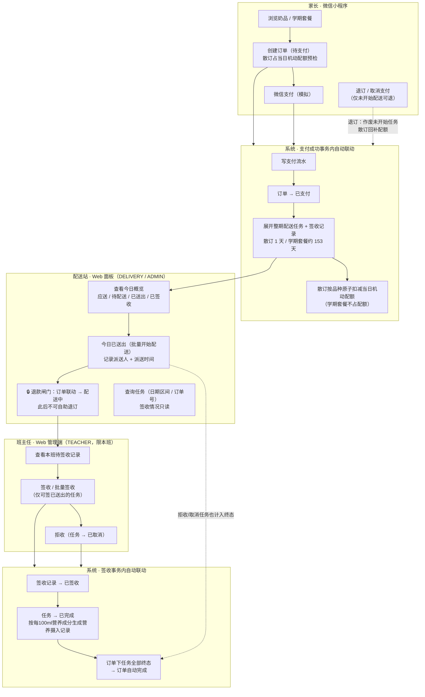
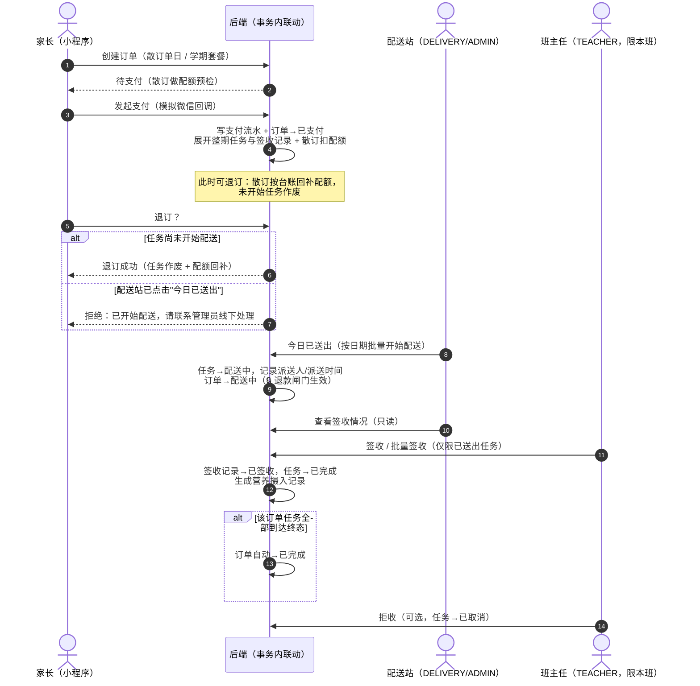
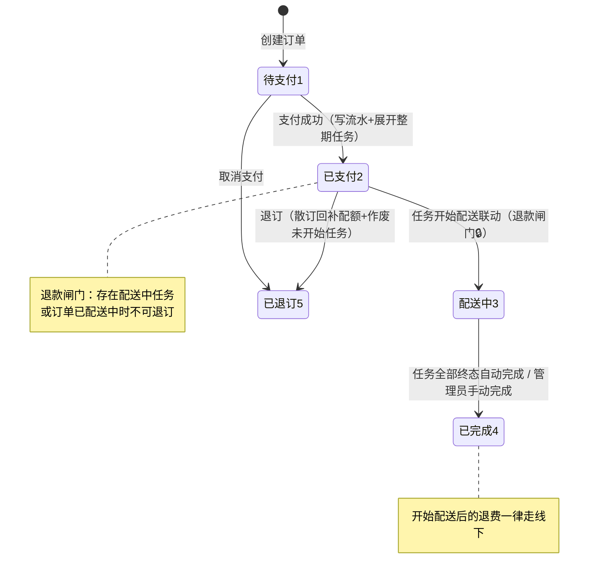
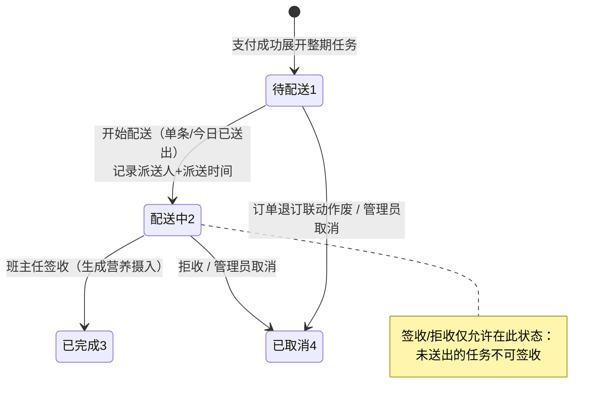

# 核心链路图

> 用 Mermaid 绘制项目核心路径：从下单到配送签收的完整链路、订单与配送任务的状态机。
> 在 GitHub/Gitea 等支持 Mermaid 的查看器中可直接渲染。

## 一、核心链路总览（按角色泳道）

## 二、核心路径时序图（含退款闸门与自动完成）

## 三、订单状态机

> 状态码：1 待支付、2 已支付、3 配送中、4 已完成、5 已退订

## 四、配送任务状态机

> 状态码：1 待配送、2 配送中、3 已完成、4 已取消；签收状态：1 已签收、2 未签收、3 拒收

## 五、角色与权限速查

| 角色 | 数据范围 | 核心操作 |
|------|----------|----------|
| ADMIN（管理员） | 全部 | 全部管理功能 + 配送任务操作（开始配送/取消/补生成）+ 代签 |
| DELIVERY（配送站） | 全部（仅配送接口） | 查看任务/今日概览、"今日已送出"、单条开始配送；签收情况只读 |
| TEACHER（班主任） | 仅本班 | 签收/批量签收（仅已送出任务）、拒收、本班学生与订单管理 |
| PARENT（家长） | 仅绑定学生 | 下单、支付、退订（未开始配送时）、查看订单/配送/营养 |
